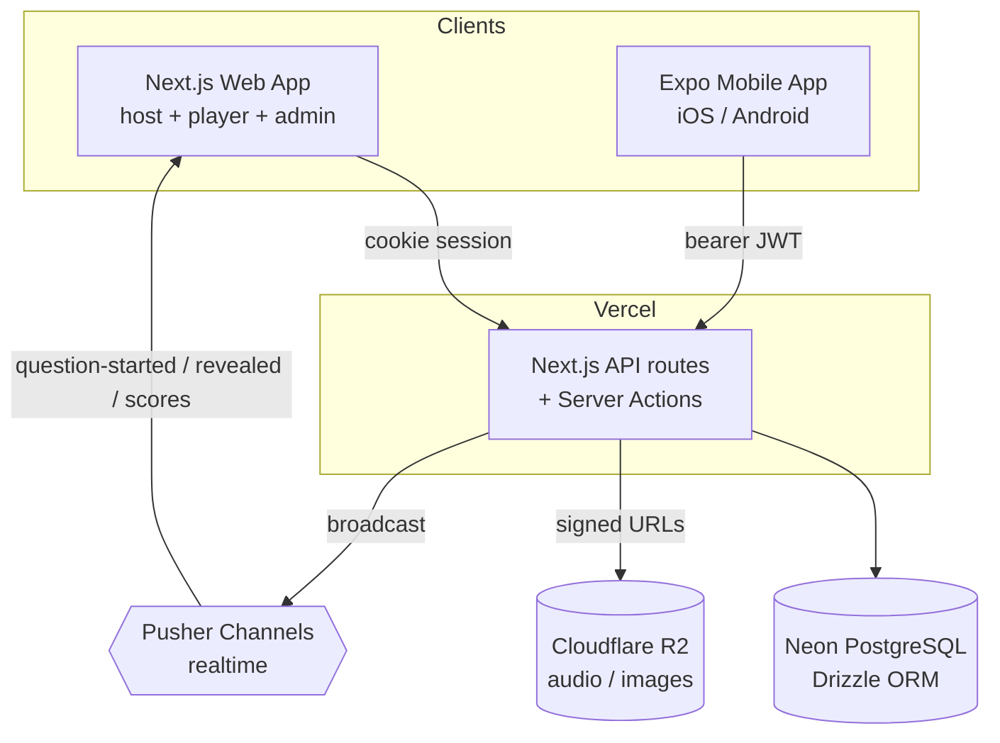

# Meloman

[](https://github.com/adibonev/Meloman/actions/workflows/ci.yml)
[](LICENSE)

> A music quiz platform for in-person trivia nights and daily music
> engagement — built as the SoftUni "Full Stack Apps with AI" capstone
> and a real product for the Bulgarian music page **Meloman**.

Two product surfaces over one shared backend:

- **Live quiz system** — fullscreen host presentation on a TV, players
  join from their phones, real-time teams, server-authoritative timer,
  automated grading with host override, per-round elimination, and an
  end-of-quiz podium.
- **Daily engagement app** — Song of the Day, a 4-stage Mystery Artist
  reveal, streaks, badges, and editorial stories.

- 🌐 **Live web app:** https://meloman-web.vercel.app
- 📱 **Mobile (web client):** https://meloman-mobile.vercel.app
- 📦 **Android APK:** Expo SDK 55 via EAS (see [Mobile App](#mobile-app))

## Contents

- [Features](#features)
- [Demo credentials](#demo-credentials)
- [Architecture](#architecture)
- [Tech stack](#tech-stack)
- [Repository layout](#repository-layout)
- [Local setup](#local-setup)
- [Mobile app](#mobile-app)
- [Quality gates](#quality-gates)
- [Roles](#roles)
- [Documentation](#documentation)
- [AI usage](#ai-usage)
- [License](#license)

## Features

- **Live quiz engine** — lobby → active → reveal → between-rounds →
  finished state machine; server-authoritative timer; captain-only
  submit; pause/resume; per-round cutoff with spectators; podium.
- **6 question types** — multiple choice, open text, audio clip (R2),
  image reveal (progressive blur), lyric fill-in, decade/year.
- **Host tools** — fullscreen presentation with keyboard controls,
  QR join code, manual answer override, between-rounds score
  adjustment, guest-host MP4 final round.
- **Per-quiz themes** — modern / vintage / neon re-skin the quiz
  surfaces (presentation, lobby, player, mobile) without touching the
  warm app shell.
- **Bilingual quizzes** — optional per-question English overlay with
  locale-aware rendering and grading.
- **Daily & editorial** — Song of the Day, 4-stage Mystery Artist
  reveal (Sofia-time, cron-backed), magazine-style stories, artist
  spotlight.
- **Admin panel** — quizzes/rounds/questions, sponsors, stories
  (TipTap), daily content, user management, analytics; server-side
  pagination across list views.
- **Mobile app** — Expo + NativeWind, 7 screens, in-app QR scanner,
  bearer-JWT API client.
- **i18n** — Bulgarian default, English under `/en` (next-intl,
  enforced BG/EN message parity).
- **Tested** — Jest (web + mobile pure logic) and a ~40-test
  Playwright suite; CI on every push and PR.

## Demo credentials

All seeded accounts use the password `demo123`.

| Role | Email | Can do |
| --- | --- | --- |
| Super admin | `super-admin@meloman.bg` | Everything incl. user management |
| Super admin | `friend@meloman.bg` | Everything incl. user management |
| Player | `player@meloman.bg` | Play quizzes, read stories, daily |

A host session is created from `/admin/quizzes` → open "Demo Music
Quiz" → **Start session**. The demo quiz contains all six question
types.

## Architecture



- **Web** authenticates with the Auth.js v5 session cookie; **mobile**
  sends a bearer JWT from `POST /api/auth/mobile-login`. The shared API
  guard accepts either.
- The database is the single source of truth; a failed Pusher broadcast
  never blocks a write, and clients fall back to polling.
- See [docs/api.md](docs/api.md) for the endpoint reference and
  [docs/database-schema.md](docs/database-schema.md) for the ER diagram
  (15 tables).

## Tech stack

| Layer | Technology |
| --- | --- |
| Web app | Next.js App Router, React, TypeScript |
| Mobile app | Expo SDK 55, expo-router, React Native |
| Database | Neon PostgreSQL + Drizzle ORM |
| Auth | Auth.js v5 + JWT roles (web cookie / mobile bearer) |
| Real-time | Pusher Channels |
| Storage | Cloudflare R2 |
| Styling | Tailwind CSS + shadcn/ui (web), Tailwind via NativeWind (mobile) |
| Validation | Zod |
| i18n | next-intl — Bulgarian default, English under `/en` |
| Testing | Jest + Playwright |
| Monorepo | Turborepo + pnpm workspaces |
| Hosting | Vercel (web) + Expo EAS (mobile) |

Technology choices are constrained by the SoftUni curriculum. Full
architecture notes live in [CLAUDE.md](CLAUDE.md).

## Repository layout

```text
meloman/
├── apps/
│   ├── web/          # Next.js app: UI, REST API, server actions, admin
│   └── mobile/       # Expo app (expo-router): 7 screens
├── packages/
│   ├── db/           # Drizzle schema, migrations, Neon client, seed
│   ├── shared/       # Cross-app design tokens / shared code
│   └── ui/           # Reserved for shared UI primitives
├── docs/             # Reference docs (+ docs/process/ history) — see docs/README.md
├── .github/          # CI workflow + PR template
├── CLAUDE.md         # Master project context for AI-assisted work
├── AGENTS.md         # AI-usage policy
└── turbo.json        # Turborepo task pipeline
```

See [docs/repository-structure.md](docs/repository-structure.md) for
folder ownership and maintenance rules.

## Local setup

### Prerequisites

- Node.js 20+ · pnpm 10.33.2+
- A Neon PostgreSQL database and an Auth.js secret
- Optional: Cloudflare R2, Pusher, Spotify, Resend credentials

### Install & configure

```bash
pnpm install
cp .env.example .env.local
cp .env.example apps/web/.env.local
```

Fill at least `DATABASE_URL` and `AUTH_SECRET`. R2 / Pusher / Spotify /
Resend variables are only needed for the features that use them.
`.env.local` is gitignored — never commit secrets.

### Database & seed

```bash
pnpm --filter @meloman/db db:migrate     # apply migrations
pnpm --filter @meloman/db db:seed        # demo users, stories, demo quiz, daily
pnpm --filter @meloman/db db:seed:bulk   # optional: 10k load-test users
```

The seed uploads demo audio/image to R2 and is idempotent.

### Run the web app

```bash
pnpm --filter @meloman/web dev           # http://localhost:3000
```

Bulgarian routes are at `/…`; English at `/en/…`.

## Mobile app

```bash
pnpm --filter mobile start               # Expo dev server
```

The mobile app talks to the deployed API
(`https://meloman-web.vercel.app`) by default, so no LAN setup is
needed.

> **Expo Go note:** the app targets **Expo SDK 55**. Store Expo Go only
> runs the latest *stable* SDK, so it cannot open this project — use a
> **development build** or the **EAS APK** below to run it on a device.

The Expo Router static export is deployed as a browser-openable
client at **https://meloman-mobile.vercel.app** — log in with the
demo player to see it talk to the live API.

```bash
pnpm --filter mobile build:web           # → apps/mobile/dist (static)
```

`apps/mobile/vercel.json` deploys that `dist/` as a static site on
Vercel (project Root Directory set to `apps/mobile`).

Android APK is built in the cloud with EAS:

```bash
cd apps/mobile
npx eas-cli@latest build --platform android --profile preview
```

Builds and the downloadable `.apk` are listed at
`https://expo.dev/accounts/adibonevs-organization/projects/meloman/builds`.

## Quality gates

```bash
pnpm --filter @meloman/web lint
pnpm --filter @meloman/web exec tsc --noEmit
pnpm --filter @meloman/web test          # Jest
pnpm --filter @meloman/web test:e2e      # Playwright smoke (CI-safe)
pnpm --filter @meloman/web test:e2e:full # Playwright full authed suite (local)
pnpm --filter @meloman/web build
pnpm --filter mobile typecheck
pnpm --filter mobile test                # mobile Jest (pure logic)
```

GitHub Actions runs lint, typecheck, web + mobile tests, the smoke
e2e suite, and the build on `main` and every PR.

## Roles

- `player` — default; plays quizzes, reads content.
- `admin` — manages quizzes, stories, daily content, sponsors,
  analytics.
- `super_admin` — all of the above plus user management.

Role-based route protection lives in
[apps/web/proxy.ts](apps/web/proxy.ts).

## Documentation

Start at [docs/README.md](docs/README.md) — it indexes the reference
docs (API, schema, structure, testing) and the historical AI-process
trail in `docs/process/`.

## AI usage

This project was built with AI-assisted development. The policy and
process are documented for transparency in [AGENTS.md](AGENTS.md) and
[CLAUDE.md](CLAUDE.md); every architecture decision and merged commit
is human-reviewed.

## License

[MIT](LICENSE).
