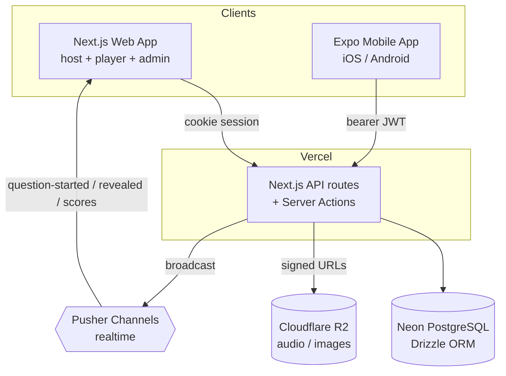

# Meloman

[](https://github.com/adibonev/meloman/actions/workflows/ci.yml)

Meloman is a music quiz platform with two product surfaces:

- **Live quiz system** for in-person trivia nights: fullscreen host
  presentation, player phones, teams, real-time events, server-authoritative
  timer, automated grading with host override, per-round elimination, and an
  end-of-quiz podium.
- **Daily engagement app** for music fans: Song of the Day, Mystery Artist,
  streaks, badges, and editorial stories.

Both surfaces share users, content, and a single REST API. The project is
Adi Bonev's SoftUni "Full Stack Apps with AI" capstone and a real product
for the Bulgarian music page Meloman.

- 🌐 **Live web app:** https://meloman-web.vercel.app
- 📱 **Android app:** Expo / EAS build — see [Mobile App](#mobile-app)

---

## Demo Credentials

All seeded accounts use the password `demo123`.

| Role | Email | Can do |
| --- | --- | --- |
| Super admin | `super-admin@meloman.bg` | Everything incl. user management |
| Super admin | `friend@meloman.bg` | Everything incl. user management |
| Player | `player@meloman.bg` | Play quizzes, read stories, daily |

A host session is created from `/admin/quizzes` → open "Demo Music Quiz" →
**Start session**. The demo quiz contains all six question types.

---

## Architecture



- **Web** authenticates with the Auth.js v5 session cookie; **mobile** sends
  a bearer JWT from `POST /api/auth/mobile-login`. The shared API guard
  accepts either.
- DB is the single source of truth; failed Pusher broadcasts never block a
  write.
- See [docs/api.md](docs/api.md) for the full endpoint reference and
  [docs/database-schema.md](docs/database-schema.md) for the ER diagram
  (15 tables).

---

## Tech Stack

| Layer | Technology |
| --- | --- |
| Web app | Next.js App Router, React, TypeScript |
| Mobile app | Expo SDK 55, expo-router, React Native |
| Database | Neon PostgreSQL + Drizzle ORM |
| Auth | Auth.js v5 + JWT roles (web cookie / mobile bearer) |
| Real-time | Pusher Channels |
| Storage | Cloudflare R2 |
| Styling | Tailwind CSS + shadcn/ui (web), Tailwind via NativeWind (mobile) |
| Validation | Zod |
| i18n | next-intl, Bulgarian default, English under `/en` |
| Testing | Jest + Playwright |
| Monorepo | Turborepo + pnpm workspaces |
| Hosting | Vercel (web) + Expo EAS (mobile) |

Technology choices are constrained by the SoftUni curriculum. See
[CLAUDE.md](CLAUDE.md) for the full architecture notes.

---

## Repository Layout

```text
meloman/
|-- apps/
|   |-- web/                  # Next.js web app, REST API, server actions, admin
|   `-- mobile/               # Expo app (expo-router): 7 screens
|-- packages/
|   |-- db/                   # Drizzle schema, migrations, Neon client, seed
|   |-- shared/               # Reserved for cross-app code
|   `-- ui/                   # Reserved for shared UI primitives
|-- docs/                     # API, DB schema, plans, handoff notes
|-- .github/workflows/        # CI automation
|-- CLAUDE.md                 # Master project context for AI-assisted work
`-- turbo.json                # Turborepo task pipeline
```

See [docs/repository-structure.md](docs/repository-structure.md) for folder
ownership and maintenance rules.

---

## Local Setup

### Prerequisites

- Node.js 20+ · pnpm 10.33.2+
- Neon PostgreSQL database, Auth.js secret
- (Optional features) Cloudflare R2, Pusher, Spotify credentials

### Install & configure

```bash
pnpm install
cp .env.example .env.local
cp .env.example apps/web/.env.local
```

Fill at least `DATABASE_URL` and `AUTH_SECRET`. R2 / Pusher / Spotify
variables are needed only for the features that use them. Never commit
`.env.local` (gitignored).

### Database & seed

```bash
pnpm --filter @meloman/db db:migrate     # apply migrations
pnpm --filter @meloman/db db:seed        # demo users, 5 stories, demo quiz, daily
```

The seed uploads demo audio/image to R2 and is idempotent.

### Run the web app

```bash
pnpm --filter @meloman/web dev           # http://localhost:3000
```

Bulgarian routes are at `/...`; English at `/en/...`.

---

## Mobile App

```bash
pnpm --filter mobile start               # Expo dev server
```

The mobile app talks to the deployed API (`https://meloman-web.vercel.app`)
by default, so no LAN setup is needed.

> **Expo Go note:** the app targets **Expo SDK 55**. The App Store / Play
> Store **Expo Go** only runs the latest *stable* SDK, so it cannot open
> this project — use a **development build** or the **EAS APK** below to
> run it on a device.

**Web build** (Expo Router static export — this is the deployed Expo
client surface):

```bash
pnpm --filter mobile build:web          # → apps/mobile/dist (static)
```

`apps/mobile/vercel.json` deploys that `dist/` as a static site on
Vercel (set the project's Root Directory to `apps/mobile`).

- 🌐 **Expo web app (live):** _set after first deploy_ — fill the
  submission form's "Expo Project Live URL" with the Vercel URL.

**Android APK** is built in the cloud with EAS:

```bash
cd apps/mobile
npx eas-cli@latest build --platform android --profile preview
```

Builds and the downloadable `.apk` are listed at
`https://expo.dev/accounts/adibonevs-organization/projects/meloman/builds`.

---

## Quality Gates

```bash
pnpm --filter @meloman/web lint
pnpm --filter @meloman/web exec tsc --noEmit
pnpm --filter @meloman/web test
pnpm --filter @meloman/web build
pnpm --filter mobile typecheck
```

GitHub Actions runs lint, typecheck, tests, and build on `main` and PRs.

---

## Roles

- `player` — default; plays quizzes, reads content.
- `admin` — manages quizzes, stories, daily content, sponsors, analytics.
- `super_admin` — all of the above plus user management.

Role-based route protection lives in [apps/web/proxy.ts](apps/web/proxy.ts).

---

## AI Usage

AI assistance is documented for transparency in
[AGENTS.md](AGENTS.md) and [CLAUDE.md](CLAUDE.md). Humans review all
architecture decisions and commits.

---

## License

See [LICENSE](LICENSE).
