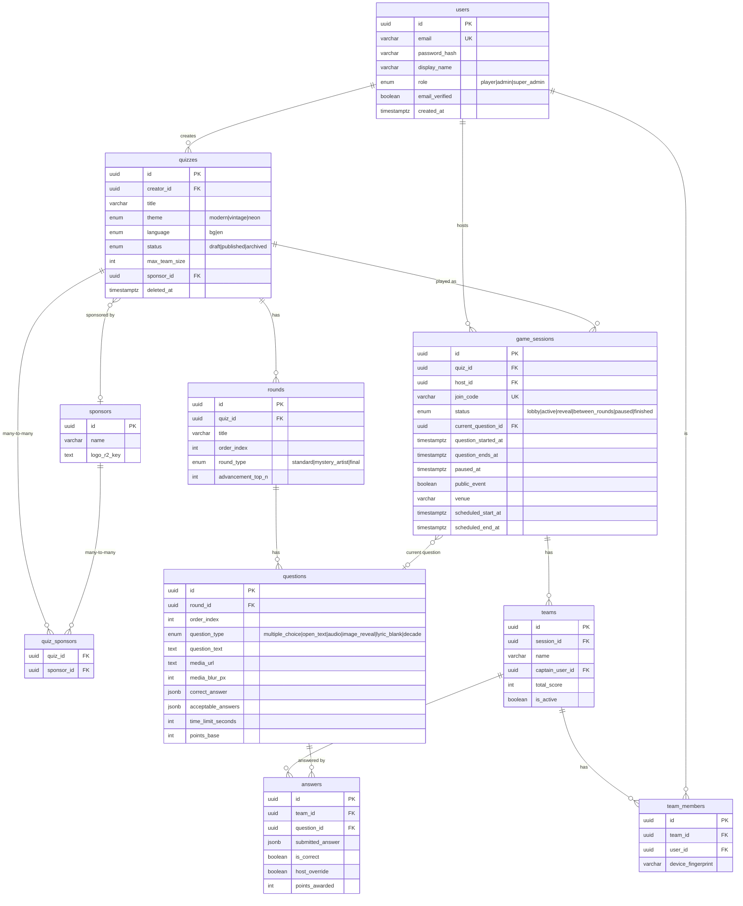
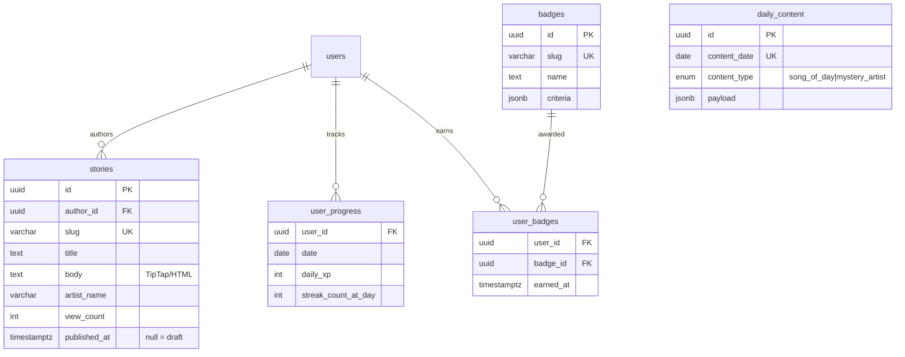

# Database Schema

Postgres (Neon, EU) via Drizzle ORM. Every table has a `uuid` PK
(`defaultRandom()`); timestamps are `timestamptz`. Enums are Postgres
`pgEnum`. Migrations live in `packages/db/migrations/`.

## ER diagram (implemented tables)

Anti-cheat: `UNIQUE(team_id, device_fingerprint)` on `team_members`;
`UNIQUE(team_id, question_id)` on `answers` (one answer per team per
question).

## Editorial & engagement tables (migrations 0009–0010)

Shipped — 15 tables total.

`user_progress` PK is `(user_id, date)`; `user_badges` PK is
`(user_id, badge_id)`. `users.banned_at` (migration 0010) gates the user
management panel.
