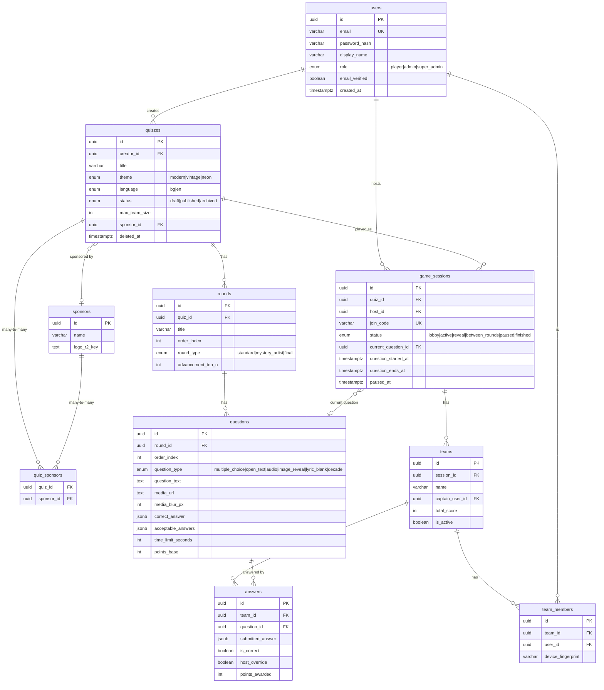

# Database Schema

Postgres (Neon, EU) via Drizzle ORM. Every table has a `uuid` PK
(`defaultRandom()`); timestamps are `timestamptz`. Enums are Postgres
`pgEnum`. Migrations live in `packages/db/migrations/`.

## ER diagram (implemented tables)

Anti-cheat: `UNIQUE(team_id, device_fingerprint)` on `team_members`;
`UNIQUE(team_id, question_id)` on `answers` (one answer per team per
question).

## Planned (Phase 2)

`stories`, `daily_content`, `user_progress`, `badges`, `user_badges` —
added with migrations when the Stories/Daily features land. This document
is updated then (per CLAUDE.md §8.10: keep docs honest).
